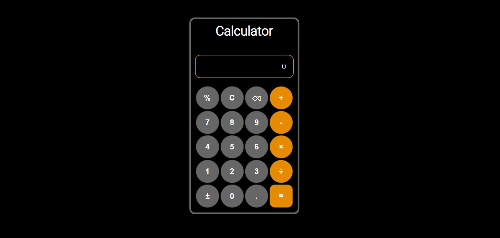

# 🔢 Simple Calculator

A simple, fully functional calculator built using **HTML**, **CSS**, and **JavaScript** that performs basic arithmetic operations. Inspired by standard calculators, this app offers a clean UI and smooth interaction for quick calculations.

---

## 🎯 Features

- Responsive calculator interface
- Perform basic arithmetic operations:
  - Addition `+`
  - Subtraction `-`
  - Multiplication `*`
  - Division `/`
- Real-time display screen for input and results
- Clear (`C`) and backspace (`←`) buttons
- Decimal and percentage (`%`) support
- Error handling for invalid operations

---

## 🖼️ Preview

 <!-- Replace with your actual screenshot -->

> Live demo: [Click here to try it out](https://agharsh53.github.io/simple-calculator)

---

## 🚀 Getting Started

### 📁 Clone the Repository

```bash
git clone https://github.com/your-username/simple-calculator.git
cd simple-calculator
